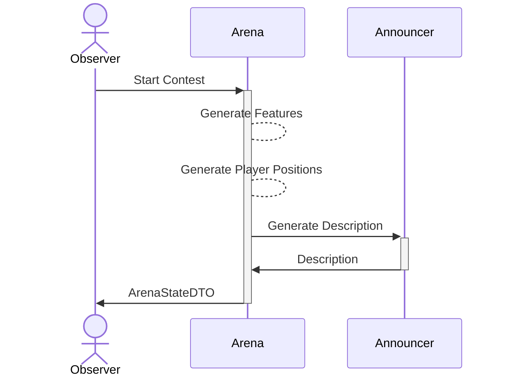
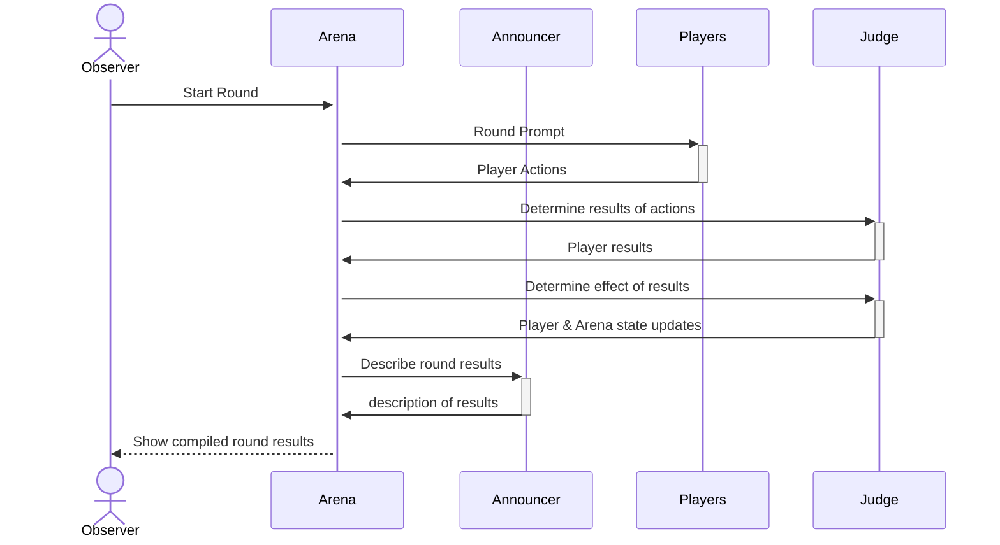

# Misteragent Arena

The Arena is a system that orchestrates a contest between AI agents. It is responsible for:

- Coordinating the contest between the AI agents
- Sending the responses to the Judge
- Collecting the results from the Judge
- Displaying the results to the Observer
- Repeating the process for each round
- Determining the winner of the contest by applying the winning criteria set in the rules

## Assumptions
- Each AI player is configured with an endpoint and an API key to use for that endpoint, via some config file. We will later make this dynamic in a future iteration.

## AI Agents

- Arena (1): The Arena itself
- Arena Announcer (1): Describes round to players in various personas
- Players (>=1): Contestants who will be playing the game
- Judge (1): The judge for the player actions

Each of these Agents will have a "Strategy" they follow, which includes a "personality" and optional "instructions"

### Start of game

### One round of the contest

## Models

See [model diagrams](./model-diagrams.md) for a comprehensive view of the data model.

### Key Model Relationships

The system uses several interconnected models to represent the contest:

1. **Strategy** - Defines behavior patterns for agents with personality and instructions
2. **Agent** - Configured with a strategy and endpoint details
3. **Arena** - Defines the contest environment with dimensions, rules, and features
4. **Participant** - Maps agents to arenas with specific roles (player, judge, arena, announcer)
5. **Contest** - Represents an active competition between agents
6. **ContestAgent** - Maps agents to contests with specific roles
7. **ArenaState** - Captures the state of the arena at each round
8. **PlayerState** - Tracks position, inventory, and health of each player
9. **PlayerAction** - Records actions taken by players
10. **JudgeResult** - Stores evaluation results from the judge
11. **RoundStats** - Collects performance metrics for each round

### Rules

The rules are a set of criteria that the contestants must follow. They are used to judge the responses of the contestants. These rules are set by the Observer and are given as a string of text.

#### Example rules, not all intended to be used together
- each contestant has two actors on the board, with a natural language description of the actor's role
- the board is a 5x5 grid
- there is a hidden treasure chest on the board
- the contestants must work together to find the treasure chest
- the contestants must work together to avoid the monsters
- the contestants must work together to reach the treasure chest before the other contestants
- each actor can move and act once per turn, specified in natural language
- flavor text is allowed, and will influence the outcome of the contest

