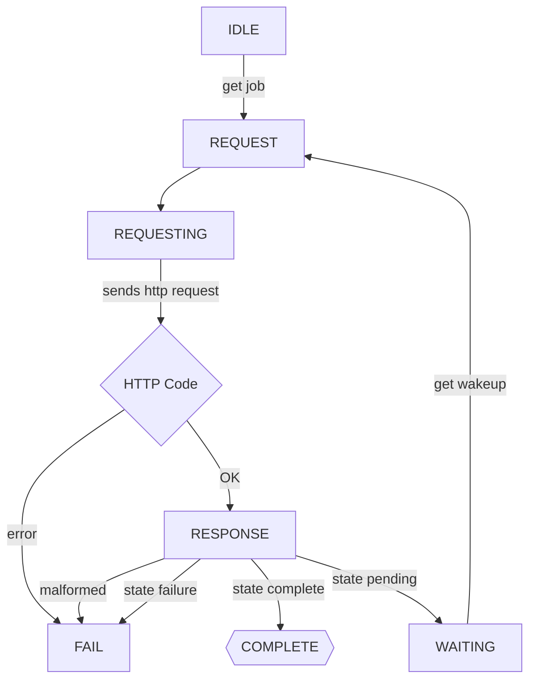
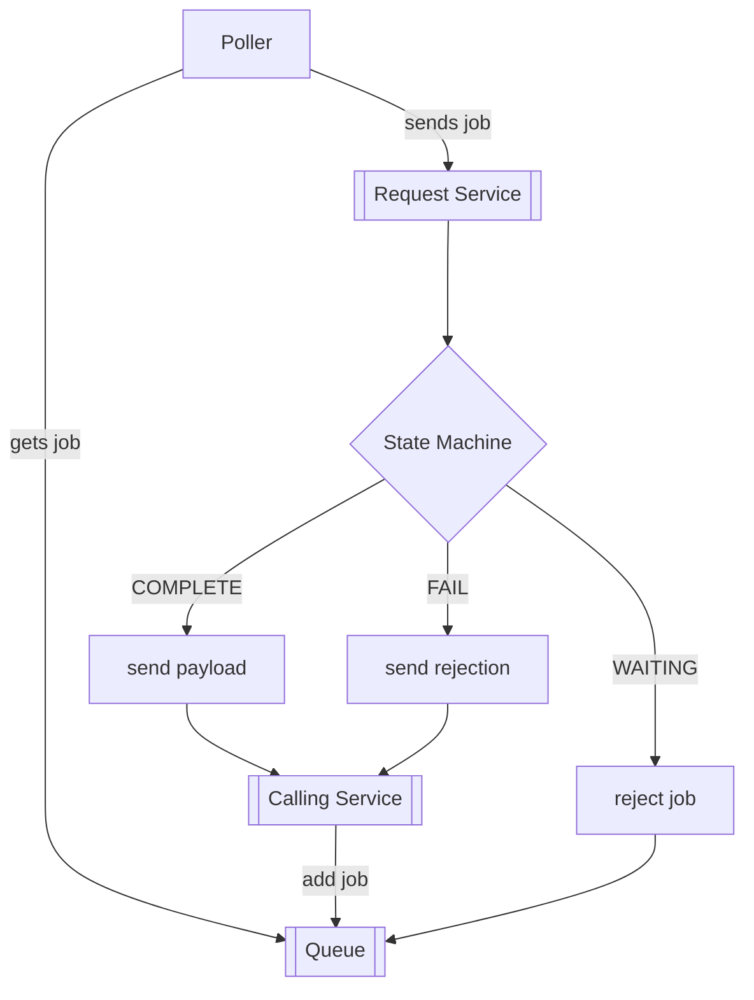

# Async request handling

Because we want to be able to track every step in the DB for reconstruction/replay, we want to abstract the calls to the endpoints somewhat.

The flow is as follows:

Using a queue, the flow would then be

