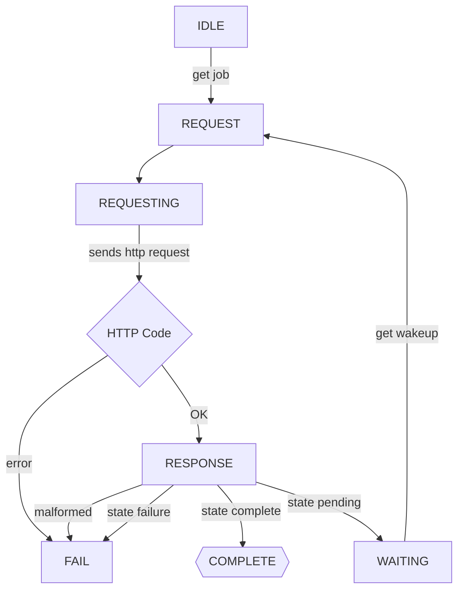
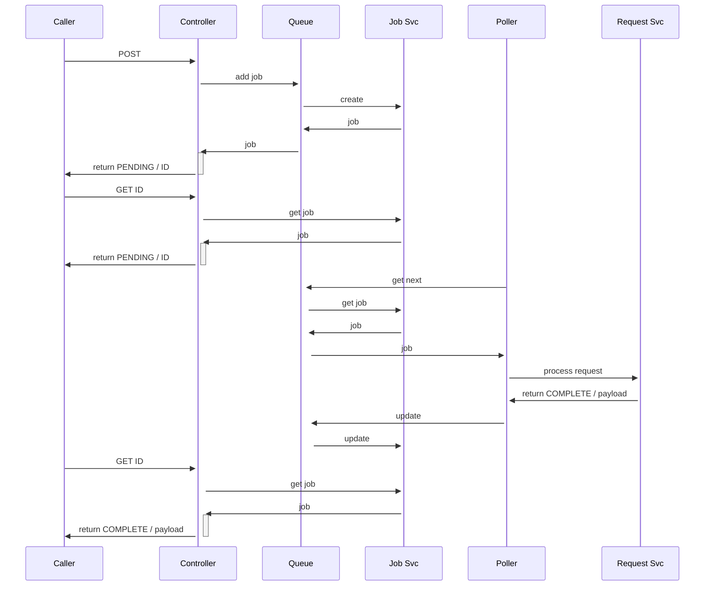
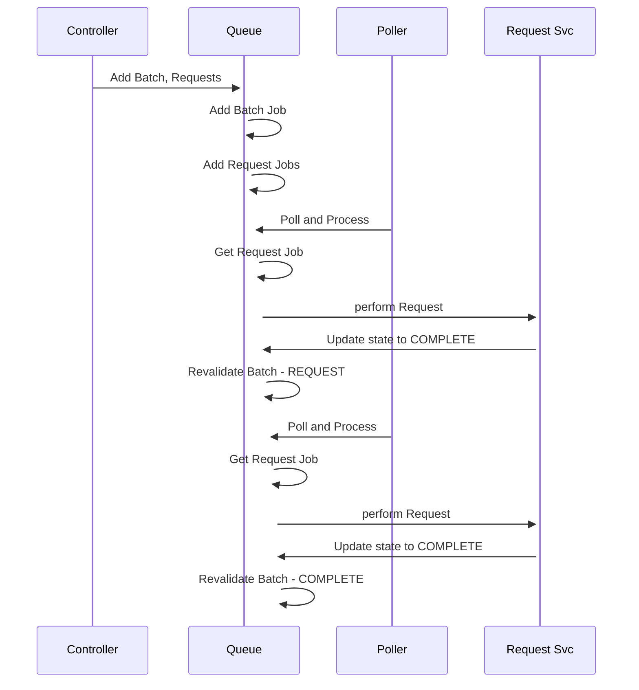

# Async request handling

Because we want to be able to track every step in the DB for reconstruction/replay, we want to abstract the calls to the endpoints somewhat.

The flow is as follows:

## State machine - ending complete

Ends complete after caller requests three times, the first time the polling loop hasn't picked it up yet

## Sequence of a batch with 2 request jobs

---

## What gets called, when

This section summarizes when messages are sent to other services or components based on job state transitions in the `QueueService`.

### Key Methods and Message Passing

- **add_job_from_message**: Receives a job via message broker and adds it to the DB. No outgoing message is sent at this point.
- **get_next**: Picks the next IDLE job, transitions it to REQUEST, and returns it for processing.
- **update_state**: Central method for changing a job's state. If the new state is a final state (`COMPLETE` or `FAIL`), triggers `send_final_message`.
- **send_final_message**: Sends a response message (with job result and state) to the job's channel via the message broker. If the job is a batch, also includes child job responses.
- **revalidate_batch**: Checks all child jobs of a batch. If all are complete or any have failed, updates the batch state and may trigger a final message.
- **update_parent_states**: When a child job reaches a final state, this is called to revalidate the parent batch, potentially triggering a message for the parent.

### Message Passing by Job State

| Job State   | Message Sent? | Method Responsible         | Notes |
|-------------|---------------|---------------------------|-------|
| IDLE        | No            | -                         | Job is queued, not yet picked up |
| REQUEST     | No            | get_next, update_state    | Job is being processed |
| RESPONSE    | No            | update_state              | Awaiting further processing |
| WAITING     | No            | update_state              | Waiting for external event |
| COMPLETE    | Yes           | update_state → send_final_message | Sends job result to channel |
| FAIL        | Yes           | update_state → send_final_message | Sends job failure to channel |

- For batch jobs, when all children are complete or any fail, `revalidate_batch` will update the batch state and trigger a message if needed.
- When a job in a batch completes or fails, `update_parent_states` is called to ensure the parent batch is revalidated and notified if necessary.

### Example: Final State Message Flow

1. A job transitions to `COMPLETE` or `FAIL` via `update_state`.
2. `send_final_message` is called, which constructs a response and sends it to the job's channel.
3. If the job is a batch, responses for all child jobs are included.
4. If the job has a parent (is part of a batch), `update_parent_states` is called to revalidate and possibly notify the parent batch.

---

This ensures that every significant state change, especially job completion or failure, is communicated to interested parties via the message broker, supporting robust async orchestration and replayability.
