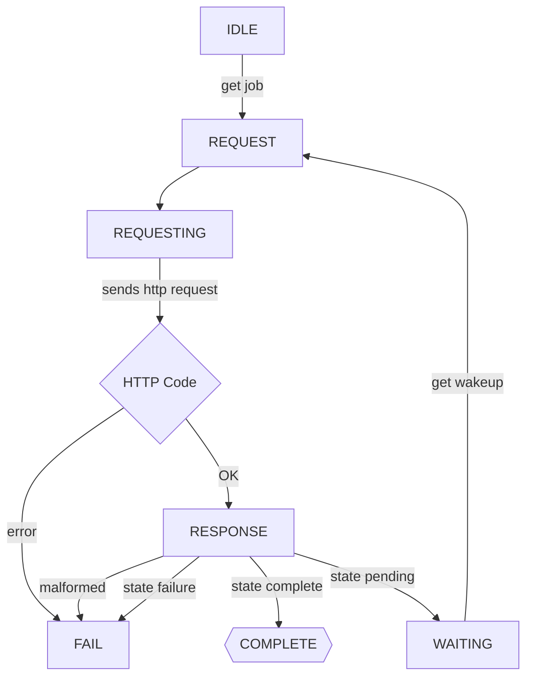
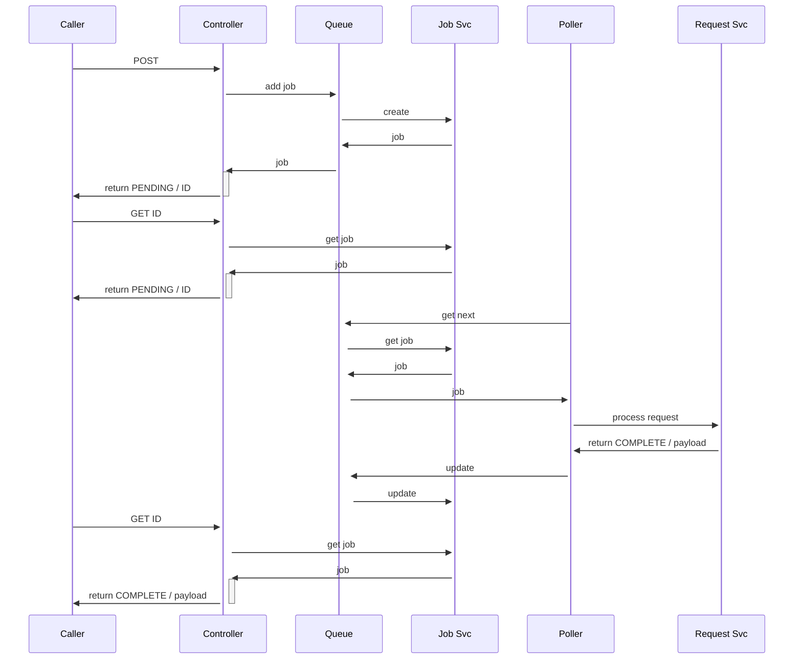
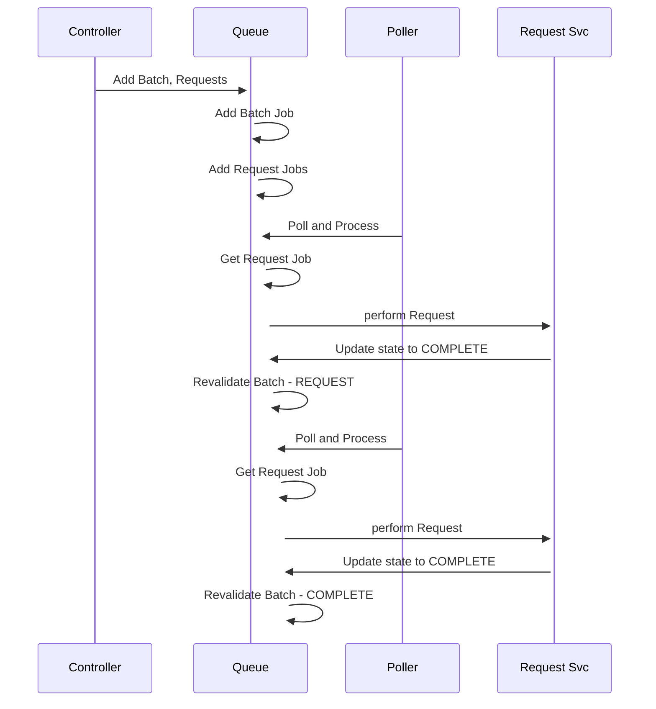

# Async request handling

Because we want to be able to track every step in the DB for reconstruction/replay, we want to abstract the calls to the endpoints somewhat.

The flow is as follows:

## State machine - ending complete

Ends complete after caller requests three times, the first time the polling loop hasn't piced it up yet

## Sequence of a batch with 2 request jobs

