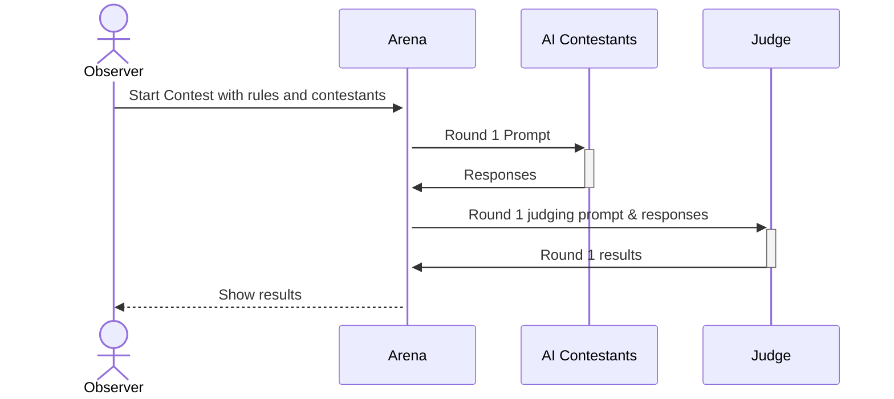

# Misteragent Arena

The Arena is a system that orchestrates a contest between AI agents. It is responsible for:

- Coordinating the contest between the AI agents
- Sending the responses to the Judge
- Collecting the results from the Judge
- Displaying the results to the Observer
- Repeating the process for each round
- Determining the winner of the contest by applying the winning criteria set in the rules

## Assumptions
- Each AI player is configured with an endpoint and an API key to use for that endpoint, via some config file. We will later make this dynamic in a future iteration.
  
### One round of the contest



```sudo
ArenaConfig {
    Contestant[]
    Judge
    Observer
    Rules
    ArenaState
    Round[]
}

Contestant {
    Endpoint
    Name
    GameStats
}

Judge {
    Endpoint
    Name
}

Observer {
    Endpoint
    Name
}

Round {
    ContestantActions[]
    ContestantResults[]
    ArenaStateResults[]
}
```


### Rules

The rules are a set of criteria that the contestants must follow. They are used to judge the responses of the contestants. These rules are set by the Observer.

#### Example rules, not all intended to be used together
- each contestant has two actors on the board, with a natural language description of the actor's role
- the board is a 5x5 grid
- there is a hidden treasure chest on the board
- the contestants must work together to find the treasure chest
- the contestants must work together to avoid the monsters
- the contestants must work together to reach the treasure chest before the other contestants
- each actor can move and act once per turn, specified in natural language
- flavor text is allowed, and will influence the outcome of the contest

### Contestant

The contestants are the AI agents that will be competing in the contest. They are responsible for generating the responses to the prompt.

### Judge

The Judge is the system that will be judging the responses of the contestants. It is responsible for applying the rules to the responses and determining the winner of the contest.


