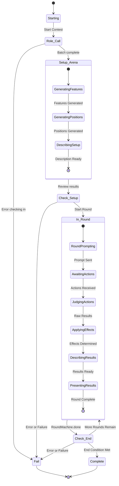

```mermaid
stateDiagram-v2
  %% Top‐level Contest machine
  [*] --> Starting
  Starting --> Role_Call           : Start Contest
  Role_Call --> Setup_Arena        : Batch complete
  Role_Call --> Fail               : Error checking in
  Setup_Arena --> Check_Setup      : Review results
  Check_Setup --> In_Round         : Start Round
  Check_Setup --> Fail             : Error or Failure
  In_Round --> Check_End           : RoundMachine.done
  Check_End --> Fail               : Error or Failure
  Check_End --> Complete           : End Condition Met
  Check_End --> In_Round           : More Rounds Remain
  Complete --> [*]
  
  %% Nested Setup machine inside InSetup
  state Setup_Arena {
    [*] --> GeneratingFeatures
    GeneratingFeatures --> GeneratingPositions : Features Generated
    GeneratingPositions --> DescribingSetup    : Positions Generated
    DescribingSetup --> [*]                    : Description Ready
  }

  %% Nested Round machine inside InRound
  state In_Round {
    [*] --> RoundPrompting
    RoundPrompting --> AwaitingActions    : Prompt Sent
    AwaitingActions --> JudgingActions    : Actions Received
    JudgingActions --> ApplyingEffects    : Raw Results
    ApplyingEffects --> DescribingResults : Effects Determined
    DescribingResults --> PresentingResults: Results Ready
    PresentingResults --> [*]             : Round Complete
  }

  Fail --> [*]

```
