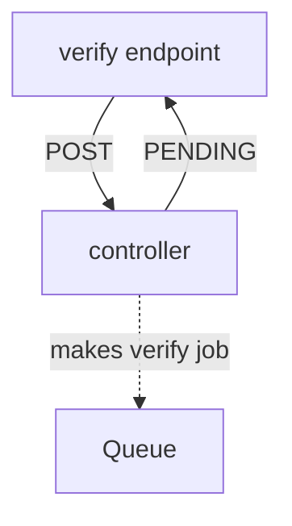
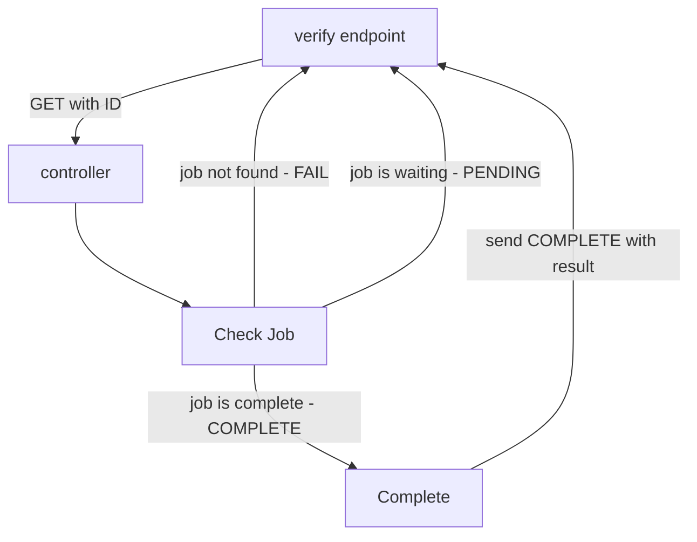
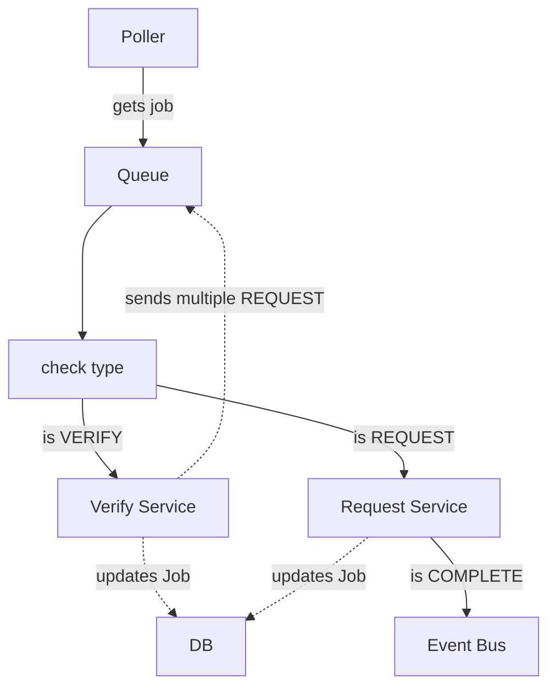
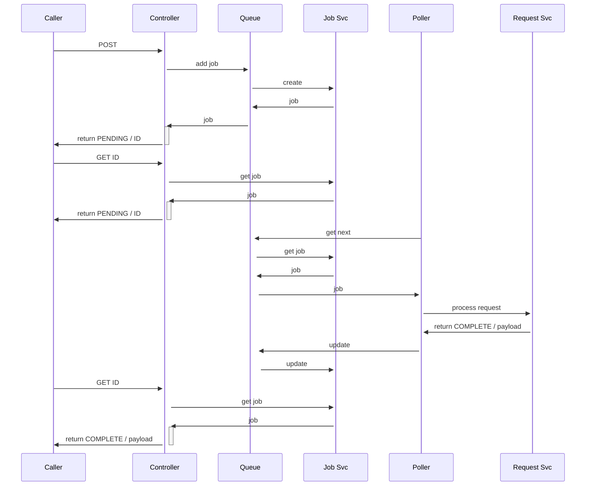

# Lab Notes

## 2025-05-07 08:04:10

I haven't been keeping good lab notes on this project. Let's start now.

I have been approaching this project with several goals:

- enjoy programming in Python again
- use mature, testable libraries as backbone
- make everything trackable and discoverable
- deterministic, except for the LLM responses

As I've developed it, I've had several major refactors, due to breakthroughs in
my understanding of several of the base techs. Dependency_injector is a powerful
library & pattern, and I'm leaning on it heavily while learning to use it effectively.

Currently, I am wrapping up a major refactor of injected controller methods1 into controller classes.
Doing so lets me avoid manual wiring, and more importantly, regularizes the responses.

I need to finish fixing the tests, then the fixture loader.

At that point, I want to write some integration test/experiments to prove out the Request [[contest-state-machines]].

Next, I think I will work on getting a polling loop running for the queue

Then, I'd like to test doing an Arena setup with features.

## 2025-05-07 08:23:22

Yes! Got all the tests fixed.

## 2025-05-07 12:44:40

I note that somehow I reverted my dropping of LiteQueue.  OK, I think that's a quick one.

I'll remove LiteQueue, since I am already doing all that in the Jobs table, and I want to, for stateful analysis later.

## 2025-05-08

Removed LiteQueue, somehow I had a detached head on Git, thanks for the Local-history plugin, I recovered it.

Pushed out to GitHub repo [agent-arena](https://github.com/0xbeedao/agent-arena?tab=readme-ov-file)

All tests pass

## 2025-05-09 13:27:06

The request_machine and service now works, and has tests.

The next steps are to test the service that is handling the request service responses, currently
named "result_service"

After that, I'd like to wire up some end-to-end tests with endpoints that sometimes respond pending.

## 2025-05-09 17:56:54

After adding the new `ready_machine`, I don't like it, too hard to think through how it would work in
a server environment.

So I will instead move to adding different "types" to the job queue, allowing `get_next` to return only specified job types.

that way, the flow for a request would be something like this:

## Make a verify participant request

## Get a verify job result

## Poller executing jobs

## Sequence of calls

## 2025-05-10 11:45:14

I've been excited about this all last night, and can't wait to get started today.

I'm going to refactor the Job system to allow for batch calls.

This job will allow for child jobs, and recursively.

The goal is to always have the job reflect the status, so when a child-job is in a final state, it causes a recursive update of the state of parent jobs.

Alright, I have the CommandJob in place, now to add methods for it in the Queue

## 2025-05-10 16:05:37

Done!

Next, add tests for batches, and make sure the terminal events work nicely.
Then, write a "participant check-in" workflow endpoint

## 2025-05-10 20:16:08

A little while watching TV.

Wrapped up batch testing using Roo, nice job Claude.

Moved api endpoints to `/api`

## 2025-05-11 13:41:57

Added the debug_controller to allow for quick creation of requests - to make sure it works live and watch all the states

## 2025-05-13 11:56:33

Aha, `JobResponseState` is or should be just the initial and final states of `JobState`. I don't need both enums - should be clearer.

Retries can be done with a new state "RETRY", and the job can have a "ttl" field which calculated against the created_date?  Not sure if I need a record for the first time it was picked up, or if I should just look it up from history.

Also could do exponential backoff.

## 2025-05-13 18:58:02

Got the create methods working - it was a fight with FastAPI, Generics and Pydantic.  I solved it by removing the generic bound "T" to DbBase. Before doing that, it was stripping all fields not in the base.

batch is having issues - I have a TODO in the queue-controller
solution is to remove "event" and just have the data be the event - it gets posted to the event listener as a string event name

## 2025-05-14 16:16:27

Success! Removed that event, and made batches callback with a simple message event.

## 2025-05-14 18:42:55

Next steps:

- [ ] Convert to Datetimes, using orjson
- [ ] Make scheduler completely independant
  - [ ] scheduler.db
  - [ ] queue_proxy on Arena side POSTs to Scheduler
  - [ ] Scheduler data payload returns the original data sent, as well as a list of final result events - allows controller to take action on results without looking up job details
- [ ] possibly refactor model tree into core, actor, arena, scheduler - with DbBase and Job in Core?
  - [ ] Or is it a refactor at a deeper level, making those be top-level packages - agentarea.core, agentarena.scheduler
