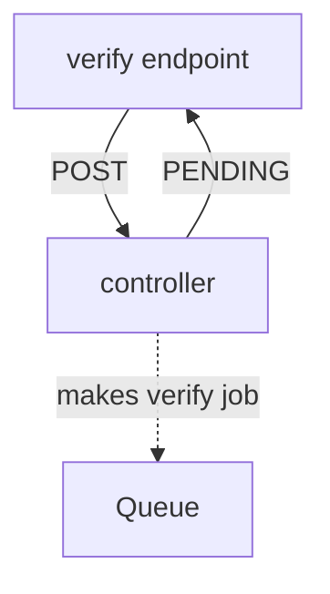
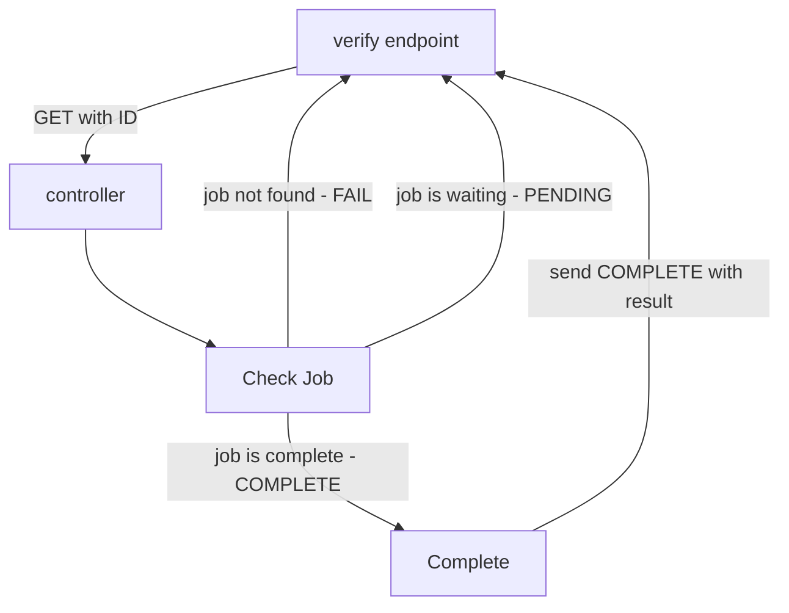
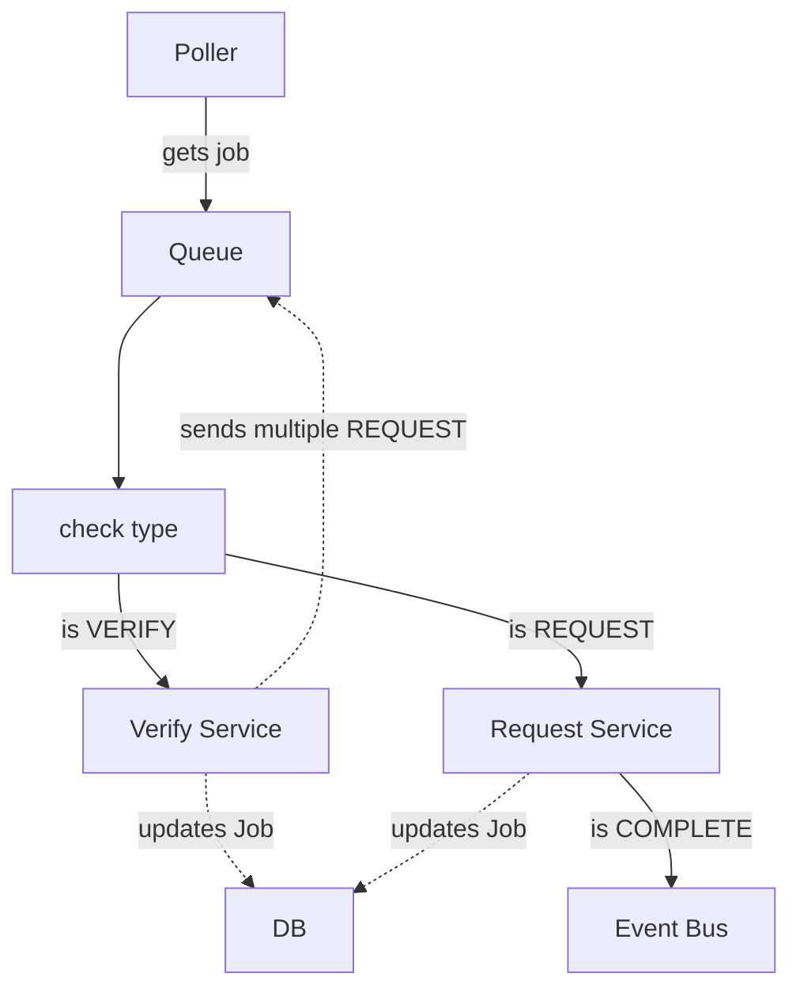
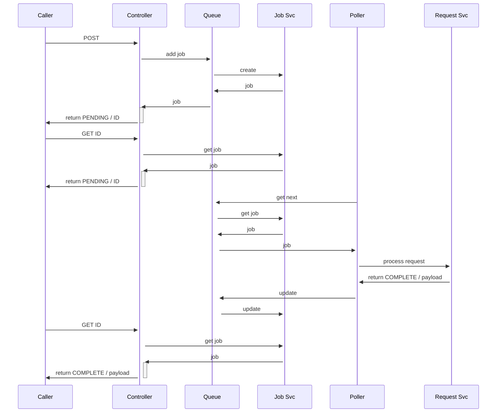

# Lab Notes

## 2025-05-07 08:04:10

I haven't been keeping good lab notes on this project. Let's start now.

I have been approaching this project with several goals:

- enjoy programming in Python again
- use mature, testable libraries as backbone
- make everything trackable and discoverable
- deterministic, except for the LLM responses

As I've developed it, I've had several major refactors, due to breakthroughs in
my understanding of several of the base techs. Dependency_injector is a powerful
library & pattern, and I'm leaning on it heavily while learning to use it effectively.

Currently, I am wrapping up a major refactor of injected controller methods1 into controller classes.
Doing so lets me avoid manual wiring, and more importantly, regularizes the responses.

I need to finish fixing the tests, then the fixture loader.

At that point, I want to write some integration test/experiments to prove out the Request [[contest-state-machines]].

Next, I think I will work on getting a polling loop running for the queue

Then, I'd like to test doing an Arena setup with features.

## 2025-05-07 08:23:22

Yes! Got all the tests fixed.

## 2025-05-07 12:44:40

I note that somehow I reverted my dropping of LiteQueue.  OK, I think that's a quick one.

I'll remove LiteQueue, since I am already doing all that in the Jobs table, and I want to, for stateful analysis later.

## 2025-05-08

Removed LiteQueue, somehow I had a detached head on Git, thanks for the Local-history plugin, I recovered it.

Pushed out to GitHub repo [agent-arena](https://github.com/0xbeedao/agent-arena?tab=readme-ov-file)

All tests pass

## 2025-05-09 13:27:06

The request_machine and service now works, and has tests.

The next steps are to test the service that is handling the request service responses, currently
named "result_service"

After that, I'd like to wire up some end-to-end tests with endpoints that sometimes respond pending.

## 2025-05-09 17:56:54

After adding the new `ready_machine`, I don't like it, too hard to think through how it would work in
a server environment.

So I will instead move to adding different "types" to the job queue, allowing `get_next` to return only specified job types.

that way, the flow for a request would be something like this:

## Make a verify participant request



## Get a verify job result



## Poller executing jobs



## Sequence of calls



## 2025-05-10 11:45:14

I've been excited about this all last night, and can't wait to get started today.

I'm going to refactor the Job system to allow for batch calls.

This job will allow for child jobs, and recursively.

The goal is to always have the job reflect the status, so when a child-job is in a final state, it causes a recursive update of the state of parent jobs.

Alright, I have the CommandJob in place, now to add methods for it in the Queue

## 2025-05-10 16:05:37

Done!

Next, add tests for batches, and make sure the terminal events work nicely.
Then, write a "participant check-in" workflow endpoint

## 2025-05-10 20:16:08

A little while watching TV.

Wrapped up batch testing using Roo, nice job Claude.

Moved api endpoints to `/api`

## 2025-05-11 13:41:57

Added the debug_controller to allow for quick creation of requests - to make sure it works live and watch all the states

## 2025-05-13 11:56:33

Aha, `JobResponseState` is or should be just the initial and final states of `JobState`. I don't need both enums - should be clearer.

Retries can be done with a new state "RETRY", and the job can have a "ttl" field which calculated against the created_date?  Not sure if I need a record for the first time it was picked up, or if I should just look it up from history.

Also could do exponential backoff.

## 2025-05-13 18:58:02

Got the create methods working - it was a fight with FastAPI, Generics and Pydantic.  I solved it by removing the generic bound "T" to DbBase. Before doing that, it was stripping all fields not in the base.

batch is having issues - I have a TODO in the queue-controller
solution is to remove "event" and just have the data be the event - it gets posted to the event listener as a string event name

## 2025-05-14 16:16:27

Success! Removed that event, and made batches callback with a simple message event.

## 2025-05-14 18:42:55

Next steps:

- [X] Review log inits - regularize on "controller", etc, instead of module="foo", allowing for default setting of levels for these.
- [X] Add Orjson
- [ ] Add orjson-pydantic, and convert to use that for serialization
- [ ] Convert to Datetimes, using orjson - note there is an option to trim microseconds automatically
- [ ] Make scheduler completely independant
  - [ ] scheduler.db
  - [ ] queue_proxy on Arena side POSTs to Scheduler
  - [ ] Scheduler data payload returns the original data sent, as well as a list of final result events - allows controller to take action on results without looking up job details
- [ ] possibly refactor model tree into core, actor, arena, scheduler - with DbBase and Job in Core?
  - [ ] Or is it a refactor at a deeper level, making those be top-level packages - agentarea.core, agentarena.scheduler
- [X] Allow log level overrides in yaml setup file

Had Claude make a JobService - need to add a send_batch equivalent, and then we can remove the direct queue calls from Arena.
Note - it should not even extend Model Service - we should directly send to q from the service.

## 2025-05-15 07:25:42

I asked ChatGPT for feedback on the project so far, and one of its suggestions was to use an ORM. I've resisted, but the main reason I did so was that I find the handling of related objects annoying in most ORMs.

So I read the docs for SQLAlchemy and it's not so bad.  But, it interferes with Pydantic.  Pydantic is for JSON/Model validation and communication, not DB storage.  Happily, I found [SQLModel](https://pypi.org/project/sqlmodel/), which appears
to be exactly what I need. It integrates Pydantic and SQLAlchemy and makes it all just declarative.

I'll end up with fully-instantiated objects that won't need "factory" methods to hydrate them. Lovely.  Also, I'll end up with better DB access without having to pass in handlers for each table. It will lead to less coupling and more reusability.

---

Also, based on [this Roocode setup doc](https://docs.google.com/document/d/1Ugiyqqa7PXqHTBwgtyhp55Hd-U0GQUuygOGdGbhP8q4/edit?tab=t.u8k2fvg0xbdu) I went ahead and added a new config `core-code` to Roocode, to try as my main coding driver.

I made a doc with Deepseek's help - [[sqlmodel-migration-plan]], which I'll execute after doing the DB separation I mention above, as it is a safer path.

## 2025-05-16 06:03:53 Fri

Had a bunch of ideas while travelling.

- Use `textual` to make a TUI for development
- Use `NATS` as my message broker
  
  ## 2025-05-18 19:15:57

  Need to get the subscriptions started after app set up.

## 2025-05-19 09:41:02

I'm at a good place with NATS - this is working!

Now I want to have a batch automatically return the final results of the request jobs on its message callback. To do that, I want to first move to SQLModel so that
hydrating all the history won't be so manual.

## 2025-05-21 19:26:18

Almost done with the SQLAlchemy conversion

Need to move the `get_session` calls to the router methods - so that i can use the controller methods without starting a new session.

## 2025-05-30 08:58:16

Oops, didn't take notes for a bit.

- I have completed and merged the SQLAlchemy conversion.
- Updated model docs, DeepSeek did a great job there.
- Refactored app packages, making clear the split in the different apps.
- Made a base ControlPanel app
- Gotten the Contest State Machine working through the first step - role_call

Next up:

- [ ] Add messaging to contest machine state changes
- [ ] Move forward to the setup machine step
- [ ] Make the CP have a contest status page that listens to events and updates the contest page

## 2025-05-30 19:30:10

Continued work on the contest flow - now working on the setup machine.  I think that I should move the big prompt to the actual arena agent side of the house. This will allow me to more easily play with different styles of feature generation, by using different strategies for it.

Also, I think that the state machines should save state to DB on change, which will allow for easier "hydration" of the machines on re-entry.

Could also use a "pause" option on all the machines for testing - so that they don't auto-step to end.

## 2025-06-05

Moved back to Cursor.

App is now working through feature creation - need to have it save state in the round as it goes, so that it will be easy to resume a contest, and to set up tests without having to cycle the whole thing every time.

## 2025-06-08

Need to debug step the "redokey" method in job_controller - why is it not rekeying?

## 2025-06-09

It is working! Just need to save this data to the actions

```json
{"channel":"arena.contest.Shut-Pedal-ATTACH-PERMIT-Animal.round.0.player.onions-Blink-maurer-trend-preach.prompt","data":"{\\"channel\\":\\"\\",                     
                             \\"data\\":\\"```json\\\\n{\\\\n  \\\\\\"action\\\\\\": \\\\\\"move\\\\\\",\\\\n  \\\\\\"target\\\\\\": \\\\\\"5,5\\\\\\",\\\\n                                             
                             \\\\\\"narration\\\\\\": \\\\\\"Merope eyes the Spectral Standard from across the courtyard, determined to claim it for her team. The cheers from the                       
                             walls only fuel her resolve as she dashes towards the center.\\\\\\",\\\\n  \\\\\\"memories\\\\\\": \\\\\\"Remembering the layout of the courtyard,                         
                             Merope notes the positions of the Beweaponed Balustrade and Treacherous Tapestry to avoid future                                                                            
                             pitfalls.\\\\\\"\\\\n}\\\\n```\\",\\"delay\\":0,\\"method\\":\\"GET\\",\\"url\\":\\"\\",\\"job_id\\":\\"Small-point-DAMIEN-EXILED-goofy\\",\\"message\\                     
                             ":\\"\\",\\"state\\":\\"complete\\",\\"child_data\\":[]}","delay":0,"method":"POST","url":"$ACTOR$/api/agent/onions-Blink-maurer-trend-preach/request",                     
                             "job_id":"best-blow-Cause-dance-RETIRE","message":"","state":"complete","child_data":[]
                             }
```

## 2025-06-10

Almost have the judge_results working - also need to debug the position and such in the player prompts

Need a way to repeat those template requests for testing.

Also would love a way to restart a round, or restart at an error even better

## 2025-06-11
