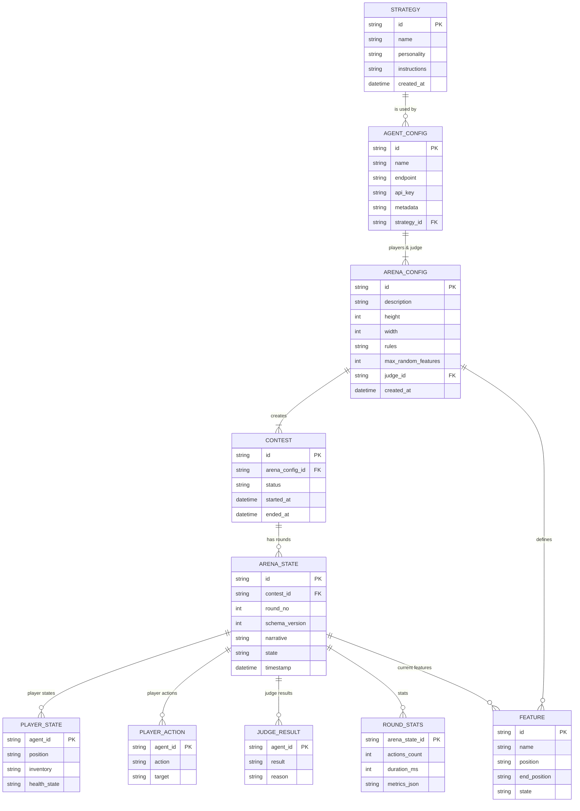

# Misteragent Arena Architecture

This document describes the current system design for **Misteragent Arena** – a platform that orchestrates a contest between AI agents.  It now contains an explicit *data model* with an Entity‑Relationship (ER) diagram written in Mermaid so it can be rendered directly in most Markdown viewers that support Mermaid.

---

## Purpose recap

- Coordinate a multi‑agent contest driven by pluggable strategies
- Expose a simple HTTP/JSON API (OpenAPI spec to be produced) so external agents can participate
- Record every round for deterministic replay & analytics

### Mermaid ER diagram

