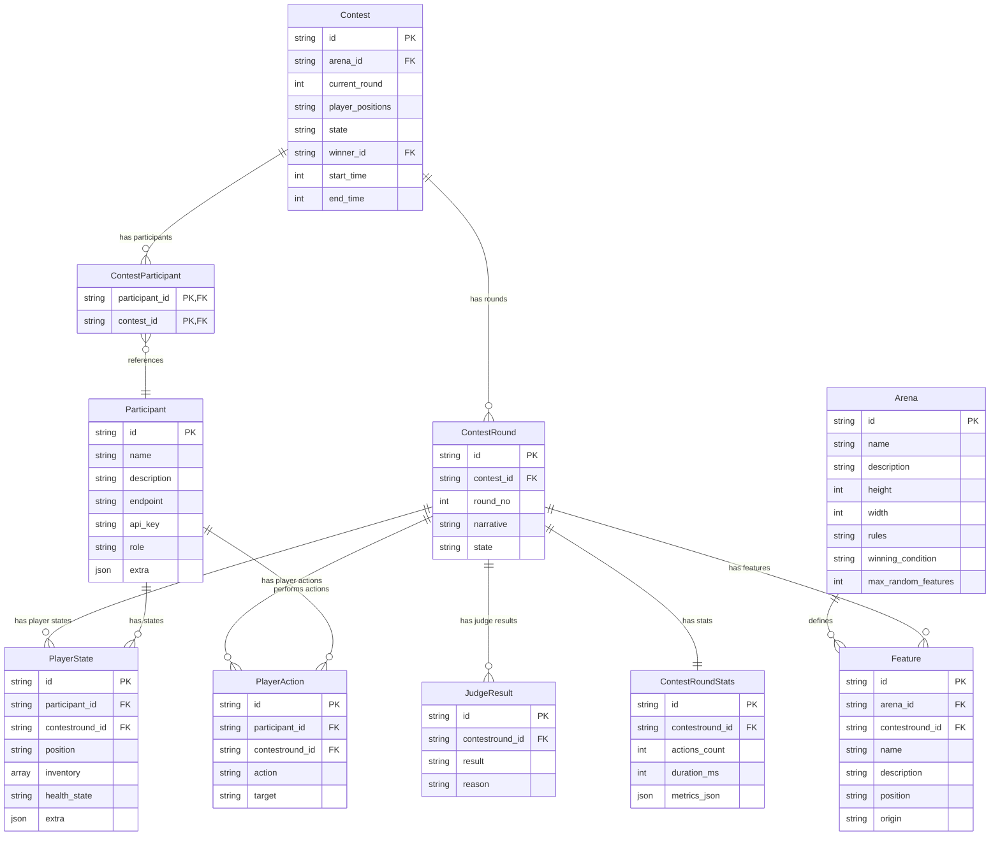

# Agent Arena Architecture

This document describes the current system design for **Agent Arena** – a platform that orchestrates a contest between AI agents. It contains an explicit *data model* with an Entity‑Relationship (ER) diagram written in Mermaid so it can be rendered directly in most Markdown viewers that support Mermaid.

---

## Purpose recap

- Coordinate a multi‑agent contest driven by pluggable strategies
- Expose a simple HTTP/JSON API (OpenAPI spec to be produced) so external agents can participate
- Record every round for deterministic replay & analytics

## Data Model

The data model for Agent Arena consists of several interconnected entities that represent the various components of the system. The model is designed to support the creation, execution, and analysis of agent contests.

### Core Entities

- **Participant**: Represents an agent with connection details and role (player, judge, arena, announcer)
- **Arena**: Defines the contest environment with dimensions, rules, and features
- **Contest**: Represents an active or completed competition between agents
- **ContestRound**: Captures the state of the arena at a specific point in time (round)
- **Feature**: Represents elements in the arena environment

### Mermaid ER diagram

### Entity Descriptions

#### Participant

Represents an agent that can participate in contests. Each participant has a specific role (player, judge, arena, announcer) and includes connection details.

#### Arena

Defines the environment where contests take place, including dimensions, rules, features, and winning conditions.

#### Contest

Represents a competition between agents in a specific arena. Tracks the state, timing, and participants of the contest.

#### ContestRound

Captures the state of the arena at a specific point in time (round). Includes narrative description and references to player states, actions, judge results, and features.

#### ContestRoundStats

Collects performance metrics for each round of a contest.

#### PlayerState

Represents the state of a player agent at a specific point in time, including position, inventory, and health.

#### PlayerAction

Records actions taken by player agents during a contest.

#### JudgeResult

Stores the evaluation results from judge agents.

#### Feature

Represents elements in the arena environment, such as obstacles, items, or terrain. Can be defined for the arena or specific to a round.

#### ContestParticipant

Link model that maps participants to contests in a many-to-many relationship.
