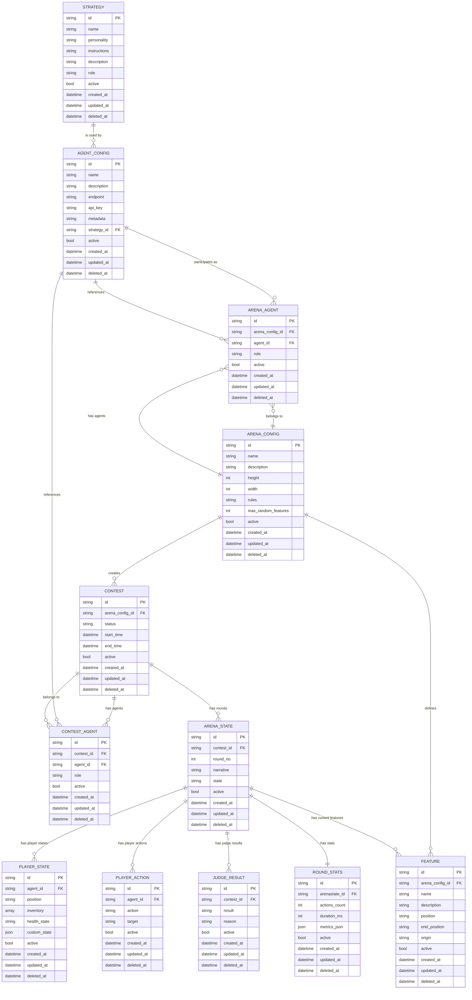

# Misteragent Arena Architecture

This document describes the current system design for **Misteragent Arena** – a platform that orchestrates a contest between AI agents. It contains an explicit *data model* with an Entity‑Relationship (ER) diagram written in Mermaid so it can be rendered directly in most Markdown viewers that support Mermaid.

---

## Purpose recap

- Coordinate a multi‑agent contest driven by pluggable strategies
- Expose a simple HTTP/JSON API (OpenAPI spec to be produced) so external agents can participate
- Record every round for deterministic replay & analytics

## Data Model

The data model for Misteragent Arena consists of several interconnected entities that represent the various components of the system. The model is designed to support the creation, execution, and analysis of agent contests.

### Core Entities

- **Strategy**: Defines behavior patterns for agents (player, judge, arena, announcer)
- **Agent**: Configures an agent with a strategy and endpoint
- **Arena**: Defines the contest environment with dimensions, rules, and features
- **Contest**: Represents an active or completed competition between agents
- **ArenaState**: Captures the state of the arena at a specific point in time (round)

### Mermaid ER diagram

### Entity Descriptions

#### Strategy
Defines behavior patterns that agents can adopt. Each strategy has a specific role (player, judge, arena, announcer) and includes personality traits and instructions.

#### Agent Configuration
Represents an agent that can participate in contests. Each agent is configured with a strategy and connection details.

#### Arena Configuration
Defines the environment where contests take place, including dimensions, rules, and features.

#### Arena Agent
Maps agents to arenas with specific roles (player, judge, arena, announcer).

#### Contest
Represents a competition between agents in a specific arena. Tracks the status and timing of the contest.

#### Contest Agent
Maps agents to contests with specific roles.

#### Arena State
Captures the state of the arena at a specific point in time (round). Includes narrative description and references to player states, actions, and judge results.

#### Player State
Represents the state of a player agent at a specific point in time, including position, inventory, and health.

#### Player Action
Records actions taken by player agents during a contest.

#### Judge Result
Stores the evaluation results from judge agents.

#### Round Stats
Collects performance metrics for each round of a contest.

#### Feature
Represents elements in the arena environment, such as obstacles, items, or terrain.
