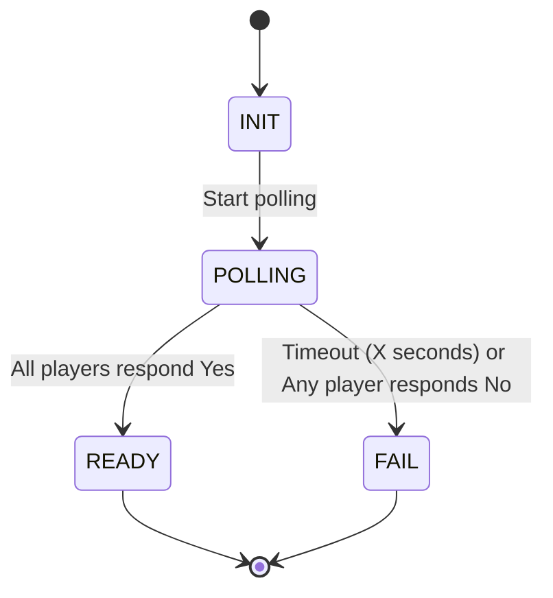

```mermaid
stateDiagram-v2
    [*] --> INIT
    INIT --> POLLING: Start polling
    POLLING --> READY: All players respond Yes
    POLLING --> FAIL: Timeout (X seconds) or Any player responds No
    READY --> [*]
    FAIL --> [*]
```