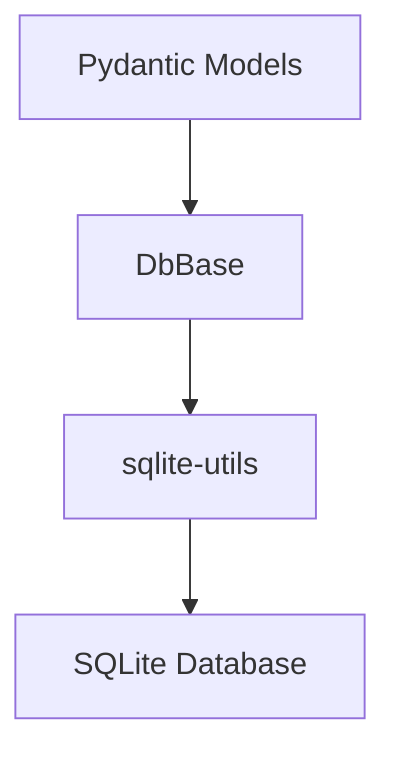
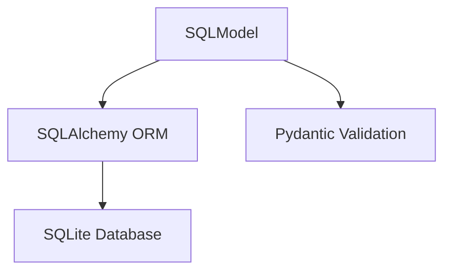

# SQLModel Migration Plan

## Overview

This document outlines the plan to migrate from sqlite-utils to SQLModel for database operations in the Agent Arena project. SQLModel provides SQLAlchemy ORM capabilities while maintaining Pydantic validation.

## Current Architecture

## Proposed Architecture

## Migration Steps

### 1. Model Updates

- [ ] Replace `DbBase` inheritance with `SQLModel`
- [ ] Convert all model fields to SQLModel Columns
- [ ] Define proper table names with `__tablename__`
- [ ] Set up relationships between models
- [ ] Maintain existing validation logic

### 2. Database Service

- [ ] Replace sqlite_utils with SQLAlchemy sessions
- [ ] Implement session factory pattern
- [ ] Update CRUD operations:
  - [ ] Create → session.add()
  - [ ] Read → session.query() or session.get()
  - [ ] Update → session.merge()
  - [ ] Delete → session.delete()

### 3. Factory Updates

- [ ] Create new SQLAlchemy engine factory
- [ ] Update dependency injection
- [ ] Modify existing factories to use sessions

### 4. Testing

- [ ] Update test fixtures
- [ ] Add relationship tests
- [ ] Verify validation still works
- [ ] Test migration scripts

## Implementation Plan

### Phase 1: Core Infrastructure

1. [ ] Set up SQLAlchemy engine factory
2. [ ] Create base SQLModel configuration
3. [ ] Implement session management

### Phase 2: Model Migration

1. [ ] Migrate simple models first (e.g., Job, Event)
2. [ ] Then migrate complex models with relationships
3. [ ] Update all model tests

### Phase 3: Service Updates

1. [ ] Update db_service.py
2. [ ] Modify queue_service.py
3. [ ] Update other dependent services

## Risks & Mitigation

| Risk | Mitigation |
|------|------------|
| Data loss during migration | Irrelevant - no data need be kept |
| Performance regression | Benchmark critical paths |
| Validation behavior changes | Comprehensive test suite |
| Complex relationship handling | Incremental implementation |
