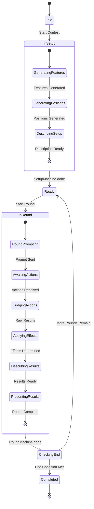

```mermaid
stateDiagram-v2
  %% Top‐level Contest machine
  [*] --> Idle

  Idle --> InSetup                 : Start Contest
  InSetup --> Ready                : SetupMachine.done
  Ready --> InRound                : Start Round
  InRound --> CheckingEnd          : RoundMachine.done
  CheckingEnd --> Completed        : End Condition Met
  CheckingEnd --> Ready            : More Rounds Remain
  Completed --> [*]

  %% Nested Setup machine inside InSetup
  state InSetup {
    [*] --> GeneratingFeatures
    GeneratingFeatures --> GeneratingPositions : Features Generated
    GeneratingPositions --> DescribingSetup    : Positions Generated
    DescribingSetup --> [*]                    : Description Ready
  }

  %% Nested Round machine inside InRound
  state InRound {
    [*] --> RoundPrompting
    RoundPrompting --> AwaitingActions    : Prompt Sent
    AwaitingActions --> JudgingActions    : Actions Received
    JudgingActions --> ApplyingEffects    : Raw Results
    ApplyingEffects --> DescribingResults : Effects Determined
    DescribingResults --> PresentingResults: Results Ready
    PresentingResults --> [*]             : Round Complete
  }
```